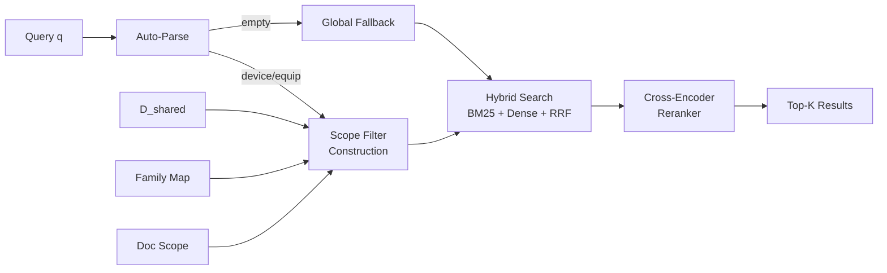
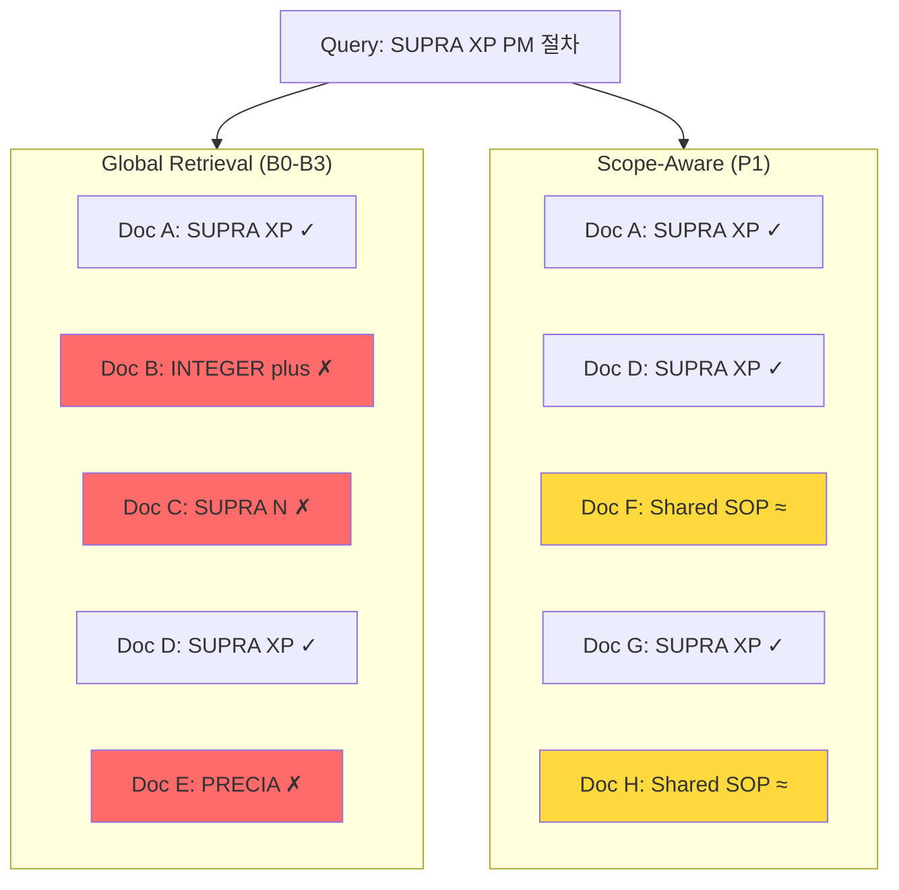
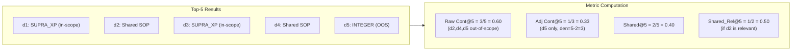

# Hierarchy-aware Scope Routing for Cross-Equipment Contamination Control in Industrial Maintenance RAG

---

# 1. Introduction

Retrieval-Augmented Generation (RAG) systems play a critical role in semiconductor manufacturing environments, where maintenance engineers query shared document repositories spanning multiple equipment types for troubleshooting and preventive maintenance procedures. These systems must ground answers in high-fidelity equipment-specific information to maintain safety and operational efficiency in high-stakes fabrication settings.

Global retrieval without scope awareness creates a fundamental challenge: documents from unrelated equipment contaminate the top-k results, risking answers grounded in incorrect procedures. For instance, a query about the SUPRA XP's calibration procedure may retrieve operation guides for INTEGER 45, misleading engineers toward inappropriate interventions. This cross-equipment contamination is not merely a ranking problem—it poses direct safety risks in manufacturing environments where procedural errors can damage equipment or compromise product quality.

A naive approach applies hard device-name filtering (system B4) to eliminate most contamination, but at a significant cost. Aggressive filtering sacrifices recall for shared procedures—standard operating procedures (SOPs) and troubleshooting guides applicable across multiple equipment types—and fails entirely when the equipment type cannot be automatically parsed from query text. For implicit queries lacking explicit device mentions, such filtering degenerates to global retrieval, offering no contamination protection.

We propose hierarchy-aware scope routing, a three-level document classification system that applies different retrieval filter granularities per document type. The approach classifies documents as *shared* (cross-equipment procedures), *device* (equipment-model-specific content), or *equip* (instance-level maintenance logs). The scope filter preserves access to shared documents while enforcing strict device-level filtering for equipment-specific procedures. We introduce Contamination@k (Cont@k) as a first-class safety metric, decomposing it into Raw and Adjusted variants to separate benign shared documents from true out-of-scope contamination.

Our evaluation uses a test set of 51 queries across three scope observability slices: explicit-device (n=22), explicit-equip (n=8), and implicit (n=21). The minimum detectable effect size for hit@5 at alpha=0.05 and power=0.8 is 0.277 (27.7 percentage points) for the full test set, with higher MDEs for smaller slices; these constraints are sufficient to detect the large contamination differences observed between scoped and unscoped systems.

This paper makes three contributions: (1) a contamination metric decomposition (Raw/Adjusted/Shared@k) that isolates true scope violations from benign shared-document retrieval; (2) a scope-level-aware filter construction that routes retrieval by document type hierarchy while preserving safety margins; and (3) empirical evaluation on a 578-document semiconductor maintenance corpus showing contamination reduction while maintaining recall for shared procedures.

The rest of this paper is organized as follows: Section 2 reviews related work on retrieval filtering and safety in RAG systems, Section 3 formalizes the methodology and scope routing policy, Section 4 describes the experimental setup and datasets, Section 5 reports results and statistical significance, Section 6 discusses findings and limitations, and Section 7 concludes.

---

# 3. Methodology

## 3.1 Problem Setting

We consider a Retrieval-Augmented Generation (RAG) system deployed in a semiconductor fabrication facility, where maintenance engineers query a shared document corpus spanning multiple equipment types. The corpus $\mathcal{D}$ contains documents of varying types (SOPs, setup manuals, troubleshooting guides, maintenance logs) across $|\mathcal{E}|$ distinct equipment devices.

**Cross-equipment contamination** occurs when documents from unrelated equipment appear in the top-$k$ retrieval results, potentially causing the generation module to produce answers grounded in incorrect procedures.

**Goal**: Design a scope routing policy that reduces contamination while preserving recall for relevant documents, including shared (cross-equipment) procedures.

## 3.2 Equipment Hierarchy

The equipment namespace follows a two-level hierarchy:

$$\text{device\_name} \rightarrow \text{equip\_id}$$

- **device_name**: Equipment model/type (e.g., "SUPRA XP", "INTEGER 45")
- **equip_id**: Physical instance identifier (e.g., "EPAG50")

Documents are authored at different granularity levels, motivating the scope_level classification (§3.4).

## 3.3 Allowed Scope

For a query $q$, we define the **allowed scope** $S(q)$ as the set of equipment entities whose documents are considered in-scope:

$$S(q) = S_{\text{hard}}(q) \cup S_{\text{family}}(q)$$

where:
- $S_{\text{hard}}(q)$: devices/equips explicitly parsed from $q$ (e.g., device name mentioned in query text)
- $S_{\text{family}}(q) = \bigcup_{d \in S_{\text{hard}}(q)} \text{Family}(d)$: family expansion for procedure documents only

For queries where the parser cannot extract scope information, a future router will provide:

$$S(q) = S_{\text{hard}}(q) \cup S_{\text{family}}(q) \cup S_{\text{routed}}(q)$$

where $S_{\text{routed}}(q)$ represents devices selected by an embedding-based router (systems P2–P4, planned). In the current evaluation, $S_{\text{routed}}(q) = \emptyset$.

A document $d$ is **in-scope** for query $q$ based on its scope_level:

$$\text{InScope}(d, q) = \begin{cases}
\text{true} & \text{if } \text{scope\_level}(d) = \texttt{shared} \\
\text{device}(d) \in S(q) & \text{if } \text{scope\_level}(d) = \texttt{device} \\
\text{equip}(d) \in S_{\text{equip}}(q) \lor \text{device}(d) \in S(q) & \text{if } \text{scope\_level}(d) = \texttt{equip}
\end{cases}$$

## 3.4 Document Scope Level

Each document is assigned a **scope_level** determining the filter granularity applied:

| scope_level | Semantics | Filter Applied | Target doc_types |
|------------|-----------|---------------|-----------------|
| `shared` | Cross-equipment document (in $D_{\text{shared}}$) | No filter (always allowed) | SOPs/TS shared across $\geq T$ devices |
| `device` | Device-level procedure | $\text{device\_name} \in S(q)$ | SOP, setup_manual, TS |
| `equip` | Instance-level record | $\text{equip\_id} \in S_{\text{equip}}(q)$ | maintenance logs (myservice, gcb) |

**Assignment rule**: scope_level is determined by doc_type with a shared override:
1. If the document's topic appears in $D_{\text{shared}}$: scope_level = `shared`
2. Else if doc_type $\in$ {myservice, gcb}: scope_level = `equip`
3. Else: scope_level = `device`

## 3.5 Shared Document Classification ($D_{\text{shared}}$)

A topic is classified as **shared** if it appears across $\geq T$ distinct devices (default $T=3$):

$$D_{\text{shared}} = \{d \mid \text{topic}(d) \in \mathcal{T}_{\text{shared}}\}$$
$$\mathcal{T}_{\text{shared}} = \{t \mid |\{e \in \mathcal{E} : t \in \text{Topics}(e)\}| \geq T\}$$

Only procedure document types (SOP, TS) are eligible for shared classification.

The threshold $T=3$ was selected as the smallest value that excludes pair-wise overlaps (which may arise from naming variants or partial equipment reuse) while capturing genuinely cross-equipment procedures. In our corpus, $T=3$ yields 124 shared documents spanning 17 global and 107 multi-device topics.

## 3.6 Equipment Family Construction

We construct equipment families using a **topic-sharing graph**:
- Nodes: devices $e \in \mathcal{E}$
- Edge weight: weighted Jaccard similarity

$$w(a, b) = \frac{\sum_{t \in T(a) \cap T(b)} \omega(t)}{\sum_{t \in T(a) \cup T(b)} \omega(t)}$$

where $\omega(t) = 1 / \log(1 + |\text{devices}(t)|)$ downweights topics shared across many devices.

Families are formed by connected components at threshold $\tau$ (default $\tau = 0.2$).

**Family expansion applies only to procedure documents** (scope_level = `device`). Logs and instance records (scope_level = `equip`) are never family-expanded to prevent cross-instance data leakage.

## 3.7 Query Scope Determination

| Parser Result | Query Type | Scope Decision |
|--------------|-----------|---------------|
| equip_id extracted | Instance query | Hard(equip): equip-level filter for logs, device filter for procedures |
| device_name only | Device query | Hard(device): device_name filter |
| Neither extracted | Implicit/ambiguous | Router mode (planned) or global fallback |

## 3.8 Scope-Level-Aware Filter Construction

The retrieval filter uses boolean OR (`should`) branches to apply different filter strengths per scope_level:

```
filter = OR(
  shared_docs,                           # scope_level=shared: always included
  device_docs AND device_name ∈ S(q),    # scope_level=device: device filter
  equip_docs AND equip_scope_filter      # scope_level=equip: equip/device filter
)
```

This is implemented in `scope_filter.py:build_scope_filter_by_doc_ids`.

## 3.9 Contamination-Aware Scoring Function (planned extension)

Beyond binary filtering, we define a scoring function that penalizes scope violations in the reranking stage:

$$\text{Score}(d, q) = \text{Base}(d, q) - \lambda(q) \cdot v_{\text{scope}}(d, q)$$

| Term | Definition |
|------|-----------|
| $\text{Base}(d, q)$ | Cross-encoder reranker score (normalized to [0, 1]) |
| $v_{\text{scope}}(d, q)$ | $\mathbb{1}[d \notin D_{\text{shared}} \wedge \text{device}(d) \notin S(q)]$ |
| $\lambda(q)$ | Penalty strength, adapted by router confidence |

**Adaptive $\lambda(q)$** (for router-mode queries):

$$\lambda(q) = \lambda_{\max} \cdot \sigma(\alpha \cdot \text{confidence}(q) - \beta)$$

where $\text{confidence}(q) = \text{score}_{\text{top1}} - \text{score}_{\text{top2}}$ from the router.

For parser-confirmed queries (Hard mode), $\lambda(q) = \lambda_{\max}$ (equivalent to binary filter).

> **Current status**: The contamination-aware scoring function (systems P6, P7) is **planned-not-reported** pending router implementation. The current evaluation covers systems B0–B4 and P1.

## 3.10 Matryoshka Router (planned extension)

For queries where the parser cannot extract device information, a low-dimensional router is planned:
- Device prototype embeddings at reduced dimensionality (64/128/256d)
- Top-$M$ device candidates selected by cosine similarity
- Family expansion applied to router output

> **Current status**: The Matryoshka router (systems P2–P4) is **planned-not-reported**. The current embedding stack (SentenceTransformer-based) supports `truncate_dim` but models have not been verified for Matryoshka Representation Learning (MRL) training (Kusupati et al., NeurIPS 2022). Fair evaluation requires MRL-trained models with full-dimension baselines.

## 3.11 System Matrix

| ID | Scope Decision | Retrieval | Rerank | Status |
|----|---------------|-----------|--------|--------|
| B0 | Global | BM25 | No | Reported |
| B1 | Global | Dense | No | Reported |
| B2 | Global | Hybrid+RRF | No | Reported |
| B3 | Global | Hybrid+RRF | Yes | Reported |
| B4 | Auto-parse Hard | Hybrid+RRF (filtered) | Yes | Reported |
| B4.5 | Auto-parse Hard + Shared | Hybrid+RRF (shared∪device filter) | Yes | Reported |
| P1 | Hard + Shared + scope_level | Hybrid+RRF (filtered) | Yes | Reported |
| P2 | Matryoshka Router Top-M | Hybrid+RRF (filtered) | Yes | Planned |
| P3 | Router + Family | Hybrid+RRF | Yes | Planned |
| P4 | Router + Family + Shared | Hybrid+RRF | Yes | Planned |
| P6 | P4 + scoring (fixed $\lambda$) | Hybrid+RRF | Yes | Planned |
| P7 | P4 + scoring (adaptive $\lambda(q)$) | Hybrid+RRF | Yes | Planned |

---

# 4. Experimental Setup

## 4.1 Corpus

- 578 documents across multiple equipment types
- Document types: SOP, setup manual, troubleshooting guide, maintenance logs (myservice, gcb)
- ES index: `rag_chunks_dev_v2`

## 4.2 Evaluation Set

- 472 total queries in `query_gold_master_v0_5.jsonl`
- Split: dev/test by stratified assignment
- Scope observability labels: `explicit_device`, `explicit_equip`, `implicit`, `ambiguous`
- Test slices: explicit_device (22), implicit (21), explicit_equip (8)
- Dev slice: ambiguous (80, no gold docs — descriptive only)

## 4.3 Systems Evaluated

- B0–B4: Baseline progression (BM25 → Dense → Hybrid → Reranker → Hard filter)
- P1: Proposed scope-level-aware filter (Hard + Shared + scope_level routing)
- P2–P7: Planned extensions (not reported)

## 4.4 Statistical Protocol

- Bootstrap CI: 2000 samples, seed 20260305
- McNemar test with continuity correction for binary CE@k
- Holm-Bonferroni correction for multiple comparisons
- All tuning on dev split only; test split results reported once

---

# Algorithm 1: Hierarchy-Aware Scope Routing

```
Input: query q, corpus D, policy artifacts (D_shared, family_map, doc_scope)
Output: ranked documents R, scope metadata

1. parsed ← AUTO_PARSE(q)                    // Extract device_name, equip_id
2. if parsed.equip_id:
3.     S_device ← {parsed.device_name}
4.     S_equip ← {parsed.equip_id}
5.     mode ← HARD_EQUIP
6. elif parsed.device_name:
7.     S_device ← {parsed.device_name}
8.     S_equip ← ∅
9.     mode ← HARD_DEVICE
10. else:
11.    S_device ← ∅; S_equip ← ∅
12.    mode ← GLOBAL_FALLBACK              // Router planned (P2-P4)

13. filter ← BUILD_SCOPE_FILTER(S_device, S_equip, D_shared, doc_scope)
14.     // OR(shared_docs, device_match, equip_match)

15. candidates ← HYBRID_RRF_RETRIEVE(q, filter, top_n=60)
16. R ← CROSS_ENCODER_RERANK(q, candidates, top_k=K)

17. return R, mode, S_device, S_equip
```

### Edge Cases

- **Empty scope fallback**: When `AUTO_PARSE` returns neither device_name nor equip_id (mode = `GLOBAL_FALLBACK`), the filter degenerates to the corpus-wide whitelist. All documents pass the scope check. This provides baseline behavior equivalent to B3.
- **doc_scope miss**: If a retrieved document's `doc_id` is not present in the policy `doc_scope` artifact, it is treated as `scope_level = device` with unknown device. Such documents are counted as out-of-scope in contamination metrics unless their `device_name` metadata matches $S(q)$.

---

# Figures

## Figure 1: Pipeline Overview



## Figure 2: Contamination Concept



## Figure 3: Shared Document Exception (Adjusted Denominator)



---

# Symbol Table

| Symbol | Definition |
|--------|-----------|
| $q$ | Input query |
| $d$ | Document |
| $\mathcal{D}$ | Full document corpus |
| $\mathcal{E}$ | Set of equipment devices |
| $S(q)$ | Allowed scope for query $q$ |
| $S_{\text{hard}}(q)$ | Parser-extracted scope (device/equip) |
| $S_{\text{family}}(q)$ | Family-expanded scope |
| $D_{\text{shared}}$ | Set of shared (cross-equipment) documents |
| $\mathcal{T}_{\text{shared}}$ | Set of shared topics |
| $T$ | Shared topic threshold (default: 3) |
| $\tau$ | Family graph edge threshold (default: 0.2) |
| $M$ | Top-M device candidates from router |
| $K$ | Top-K retrieval cutoff |
| $\text{Family}(d)$ | Equipment family containing device $d$ |
| $v_{\text{scope}}(d, q)$ | Scope violation indicator (binary) |
| $\lambda(q)$ | Query-adaptive penalty strength |
| $\omega(t)$ | Topic weight: $1/\log(1 + |\text{devices}(t)|)$ |

---

# Metric Table

| Metric | Formula | Role |
|--------|---------|------|
| Raw Cont@k | $(1/k) \sum_{i=1}^{k} \mathbb{1}[\text{device}(d_i) \notin S(q)]$ | Strict contamination (includes shared) |
| Adj Cont@k | $(1/k) \sum_{i=1}^{k} \mathbb{1}[d_i \notin D_{\text{shared}} \wedge \text{device}(d_i) \notin S(q)]$ | **Primary claim metric** |
| Shared@k | $(1/k) \sum_{i=1}^{k} \mathbb{1}[d_i \in D_{\text{shared}}]$ | Shared doc proportion |
| CE@k | $\mathbb{1}[\exists i \leq k : d_i \text{ is OOS and not shared}]$ | Binary contamination existence |
| Hit@k | $\mathbb{1}[\exists i \leq k : d_i \in \text{Gold}(q)]$ | Recall |
| MRR | $1 / \text{rank}(\text{first gold doc})$ | Ranking quality |
| ScopeAccuracy@M | $\mathbb{1}[\text{gold device} \in \text{Router Top-M}]$ | Router quality (P2-P4 only) |
