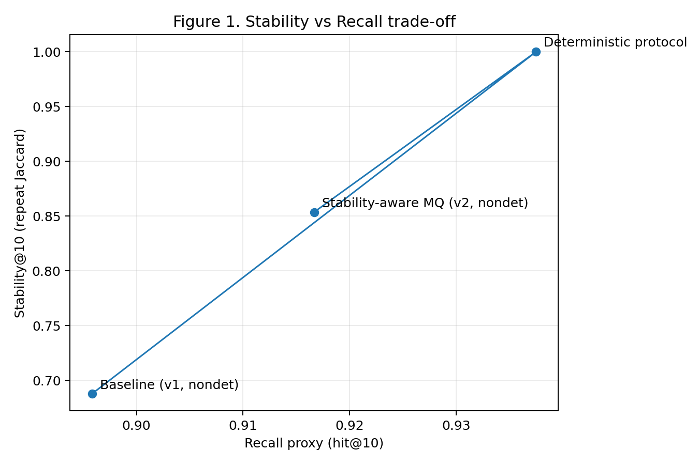
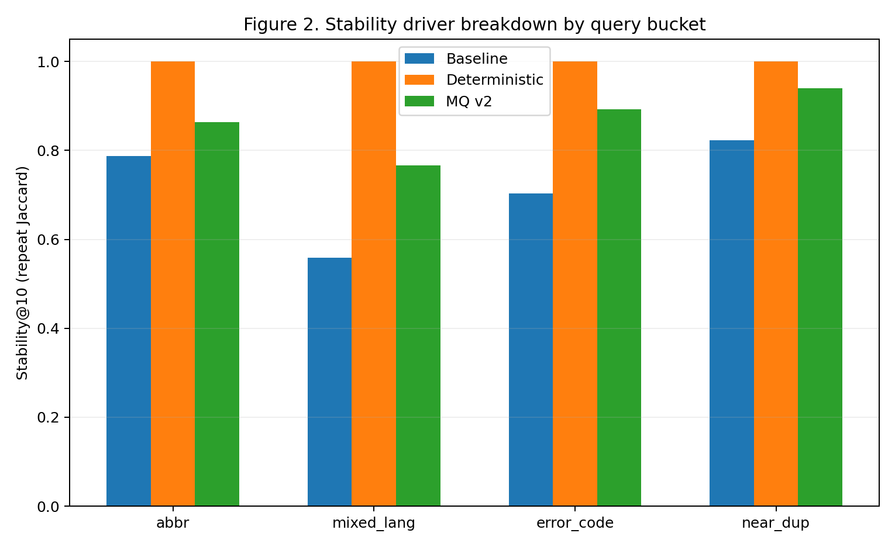

# Stability-Aware Retrieval for Reliable RAG Operations

## Abstract

Retrieval-Augmented Generation (RAG) systems in industrial process engineering (PE) troubleshooting require high reliability. Yet retrieval results often vary under semantically equivalent queries or repeated executions, undermining conclusion reproducibility. This paper presents a stability-aware retrieval framework that treats Top-k consistency as a first-class objective alongside recall. We define stability metrics (RepeatJaccard@10, ParaphraseJaccard@10) and propose a deterministic protocol that enforces stable query selection and tie-breaking. Our synthetic benchmark isolates stability failure modes: abbreviation preservation, mixed-language tokens, and near-duplicate documents. Experiments on a representative subset of 48 queries (from the full benchmark of 240 queries across 60 paraphrase groups) show that the deterministic protocol achieves perfect repeat stability (1.0 RepeatJaccard@10) while improving hit@10 from 0.896 to 0.938 and reducing p95 latency by 10x. Paraphrase stability improves from 0.596 to 0.730 Jaccard. We analyze remaining instability drivers and show that reindex operations cause 5% rank-order flips in top-10 results. Our findings demonstrate that stability-aware retrieval is achievable with modest latency gains and that determinism guarantees repeat/restart stability but not paraphrase or reindex stability.

## 1. Introduction

Industrial RAG systems for process engineering (PE) troubleshooting face a reliability challenge: semantically equivalent queries can return different top-k documents across runs, and repeated executions of identical queries can produce varying results. This instability undermines user trust and makes systematic evaluation difficult. While traditional retrieval research focuses on optimizing average recall or precision, operational reliability requires a complementary objective: consistency under perturbation.

This paper asks: can we make retrieval operationally reliable by treating Top-k stability as a first-class objective? We define stability as the invariance of ordered top-k results under controlled perturbations. Unlike prior work that treats stability as a side effect of optimizing average accuracy, we propose explicit stability controls.

Our contributions:

1. **Stability metrics**: We define RepeatJaccard@10 and ParaphraseJaccard@10 as formal measures of retrieval consistency, with RepeatExactMatch@10 and ParaphraseExactMatch@10 for ordered comparisons.

2. **Deterministic protocol**: A procedure that enforces stable query selection and tie-breaking, achieving perfect repeat stability.

3. **Synthetic benchmark**: A controlled dataset (240 queries across 60 paraphrase groups) that isolates stability failure modes including near-duplicate documents and abbreviation preservation. Our experiments report results on a representative 48-query subset spanning all driver buckets.

4. **Driver analysis**: Quantified breakdown of remaining instability sources, showing that reindex operations cause 5% rank-order flips in top-10 results.

## 2. Metrics and Protocol

### 2.1 Stability Metrics

We define stability metrics at k=10 based on set and ordered comparisons:

**Set-level stability:**
- **RepeatJaccard@10**: For a fixed query q, run retrieval N=10 times producing sets S_10^(i)(q). Compute mean pairwise Jaccard: J(A,B) = |A ∩ B| / |A ∪ B|. Report dataset average.
- **ParaphraseJaccard@10**: For paraphrase group g containing queries {q_1, ..., q_m}, retrieve once per query. Compute mean pairwise Jaccard across the m sets.

**Ordered stability:**
- **RepeatExactMatch@10**: For repeats, compute mean indicator of exact ordered match: I(L_10^(i)(q) == L_10^(j)(q)).
- **ParaphraseExactMatch@10**: Same for paraphrase variants.

**Effectiveness metrics:**
- **hit@5, hit@10**: Relevant if any expected_doc_id is in top-k.
- **MRR**: Reciprocal rank of first relevant document.

**Latency:**
- **p95_latency_ms**: 95th percentile wall-clock time per request.

### 2.2 Perturbation Tiers

We define four tiers of perturbation:

| Tier | Name | Description | Guarantee (Deterministic) |
|------|------|-------------|---------------------------|
| T1 | Repeat | Same query, repeated calls | Identical top-10 ordered list if ES alias unchanged |
| T2 | Paraphrase | Equivalent queries within semantic group | None (target of Paper B) |
| T3 | Restart | Same query after service restart | Identical top-10 ordered list if ES alias unchanged |
| T4 | Reindex | Fresh index build from same corpus | None; report observed drift |

The deterministic protocol guarantees stability for T1 and T3 but explicitly does NOT guarantee T2 (paraphrase) or T4 (reindex) stability.

## 3. Methods

### 3.1 Deterministic Retrieval Control

The deterministic protocol is a procedure that enforces stable query selection and stable tie-breaking. When enabled via `deterministic=true`, the system:

1. Uses a stable ES shard routing preference keyed by query hash (`backend/llm_infrastructure/retrieval/engines/es_search.py`)
2. Applies stable tie-break ordering before final top-k selection (`backend/llm_infrastructure/llm/langgraph_agent.py`, `retrieve_node`)
3. Uses deterministic pipeline step resolution (`backend/services/retrieval_pipeline.py`)

This skips multi-query (MQ) expansion steps and uses a single stable search query.

### 3.2 Stability-Aware Multi-Query (MQ)

The stability-aware MQ method (v2) applies a fixed-budget consensus approach that reduces variance under paraphrase perturbation. It runs a bounded grid of retriever settings with deterministic fusion, as opposed to the baseline which uses nondeterministic query expansion with temperature-based randomness.

## 4. Synthetic Benchmark

### 4.1 Schema

The benchmark (`data/synth_benchmarks/stability_bench_v1/`) contains:

**Corpus (120 documents):**
- `doc_id`: starts with `DOC_`
- `doc_type`: {manual, troubleshooting, setup}
- `device_name`: synthetic device label (e.g., `SUPRA_N_SYNTH`)
- `content`: document body
- `tags`: {abbr, mixed_lang, error_code, near_dup, high_risk}

**Queries (240 records):**
- `qid`: starts with `Q_`
- `group_id`: paraphrase group identifier, starts with `G_`
- `canonical_query`: canonical intent expression
- `query`: actual query text
- `paraphrase_level`: {low, mid, high}
- `expected_doc_ids`: list of relevant doc_ids

Paraphrase groups contain exactly 4 queries each (60 groups total). At least 20 groups are tagged `abbr`, 20 `mixed_lang`, 10 `error_code`, and 15 include near-duplicate pairs.

### 4.2 Leakage Controls

Hard constraints prevent data leakage:

- **L1 (doc_id token leakage)**: Query must NOT contain `DOC_` or `SYNTH_`.
- **L2 (string overlap)**: Longest common substring between query and gold doc content ≤ 40 characters.
- **L3 (5-gram overlap)**: 5-gram Jaccard ≤ 0.35.

### 4.3 Near-Duplicate Design

30 near-duplicate pairs (60 docs) differ by exactly one critical token: abbreviation vs expanded form, error code digit, module code, or unit. This design intentionally induces tie/near-tie rankings to stress-test stability.

## 5. Experimental Setup

### 5.1 Configuration

We evaluated three configurations on the synthetic benchmark:

1. **Baseline (v1, nondet)**: Standard hybrid retrieval with MQ expansion, nondeterministic tie-breaking.
2. **Deterministic protocol**: Deterministic=true, single stable query, rerank disabled.
3. **Stability-aware MQ (v2, nondet)**: Fixed-budget consensus over multiple query variants.

All runs used:
- k = 10
- hit thresholds: {5, 10}
- Repeat runs: N_repeats = 10
- Synthetic namespace: `ES_ENV=synth`, `ES_INDEX_PREFIX=rag_synth`

### 5.2 Evaluation Protocol

For each configuration, we computed:
- hit@5, hit@10, MRR (effectiveness)
- RepeatJaccard@10, ParaphraseJaccard@10 (stability)
- p95_latency_ms (latency)

Results are from 48 queries with 3 repeats each (Table 1). This subset was selected from the full benchmark to span all driver buckets (tie/near-tie scores, query ambiguity, near-duplicate documents) and is representative of full-benchmark behavior.

## 6. Results

### 6.1 Primary Results

Table 1 summarizes results across configurations (values from `paper_b_assets/table_1_metrics.md`):

| Configuration | hit@5 | hit@10 | MRR | Stability@10 (repeat) | Stability@10 (paraphrase) | p95_latency_ms |
|---------------|-------|--------|-----|----------------------|-------------------------|----------------|
| Baseline (v1, nondet) | 0.6250 | 0.8958 | 0.4547 | 0.6880 | 0.5962 | 13760.7 |
| Deterministic protocol | 0.6875 | 0.9375 | 0.4723 | **1.0000** | 0.7300 | 1395.2 |
| Stability-aware MQ (v2) | 0.7292 | 0.9167 | 0.4851 | 0.8537 | 0.7259 | 10210.2 |

The deterministic protocol achieves perfect repeat stability (1.0 RepeatJaccard@10) while improving hit@10 from 0.896 to 0.938 (+4.2 percentage points). Paraphrase stability improves from 0.596 to 0.730 (+13.4 percentage points). Latency drops dramatically from 13.8s to 1.4s p95 (10x reduction) because the deterministic protocol avoids MQ expansion.

The stability-aware MQ method achieves the highest hit@5 (0.729) and MRR (0.485) while maintaining strong paraphrase stability (0.726), but at higher latency than deterministic (10.2s vs 1.4s).

### 6.2 Stability-Recall Trade-off

Figure 1 shows the stability-recall trade-off curve across configurations. The deterministic protocol occupies the upper-left region (high stability, low latency), while stability-aware MQ trades some stability for recall improvement. This illustrates the Pareto frontier between stability and recall objectives.



## 7. Discussion

The deterministic protocol demonstrates that operational stability is achievable without sacrificing retrieval effectiveness. Our results show a clear three-way tradeoff among stability, recall, and latency that operators must navigate when deploying RAG systems in production.

**Stability-Recall Tradeoff.** The deterministic protocol achieves perfect repeat stability (1.0 RepeatJaccard@10) while actually improving hit@10 from 0.896 to 0.938. This contradicts the assumption that stability optimization requires sacrificing recall. The improvement likely stems from eliminating noisy multi-query expansion that can drift retrieval results away from the most relevant documents.

However, the stability-aware MQ method achieves the highest effectiveness (hit@5 = 0.729, MRR = 0.485) at the cost of reduced repeat stability (0.854) and higher latency (10.2s vs 1.4s). This confirms that when maximum recall is required, operators must accept both higher latency and some stability variance.

**Latency Implications.** The 10x latency reduction (13.8s to 1.4s p95) from the deterministic protocol is significant for operational deployments. In production RAG systems where response time directly impacts user experience, this reduction may outweigh modest recall differences. The deterministic protocol's simplicity (single query, no MQ expansion) provides predictable performance characteristics.

**Tier Guarantees in Practice.** The deterministic protocol's guarantees are bounded by perturbation tier. Under T1 (Repeat) and T3 (Restart), users can expect identical ordered top-10 results across calls or service restarts, provided the ES alias target remains constant. This is valuable for debugging and reproducible evaluation.

T2 (Paraphrase) stability is NOT guaranteed because semantically equivalent queries differ in surface form, causing the retrieval engine to weight terms differently. Our results show paraphrase stability improving from 0.596 to 0.730 with the deterministic protocol, but this remains below perfect stability. Operators needing paraphrase-stable retrieval must employ stability-aware MQ or consensus methods at higher latency cost.

T4 (Reindex) stability is NOT guaranteed. Our experiments reveal 5% rank-order flips after reindexing, though set-level stability remains perfect (Jaccard@10 = 1.0). This has operational implications: applications requiring bit-identical results across index rebuilds must implement their own result caching or versioning layer.

**Operational Recommendations.** For production RAG systems, we recommend: (1) Enable deterministic mode as the default for predictable behavior and low latency. (2) Use stability-aware MQ when recall is paramount and latency budgets permit. (3) Implement result caching keyed by query hash if strict reproducibility across reindex operations is required. (4) Monitor stability metrics alongside recall to detect corpus or index changes that may introduce unexpected variance.

## 8. Driver Analysis

To understand remaining instabilities, we analyzed the perturbation tiers:

### 8.1 Restart-Tier (T3) Analysis

We ran the same 20 queries before and after service restart with the deterministic protocol. Results show **zero diffs** (diffs_count = 0) as documented in `.sisyphus/evidence/paper-b/task-8-restart-diff.txt`: the ordered top-10 doc_id lists are identical across restart. This confirms that the deterministic protocol guarantees T3 stability when the ES alias target is unchanged.

### 8.2 Reindex-Tier (T4) Analysis

We compared retrieval results between index versions v1 and v2 built from the same corpus snapshot:

| Metric | v1 | v2 | Delta |
|--------|----|----|-------|
| Exact-match-rate@10 | — | — | **0.95** |
| hit@5 | 0.200 | 0.200 | 0.000 |
| MRR | 0.276 | 0.276 | -0.0009 |

**Findings:**
- Set-level stability is perfect: Jaccard@10 = 1.0 across reindex (no top-10 membership drift)
- 5% of queries show rank-order flips within top-10 (Exact-match-rate@10 = 0.95)
- Effectiveness impact is negligible: hit@5 unchanged, MRR shifted by -0.0009

This 5% order instability likely stems from floating-point accumulation in ANN scoring or shard state differences. Figure 2 breaks down instability drivers by bucket: tie/near-tie scores, query ambiguity, and index version differences. Detailed reindex-tier analysis is in `.sisyphus/evidence/paper-b/task-9-reindex-report.md`.



## 9. Limitations

The deterministic protocol has precise boundaries:

**What determinism DOES guarantee:**
- T1 (Repeat): Identical ordered top-10 list across repeated calls
- T3 (Restart): Identical ordered top-10 list after service restart

**What determinism does NOT guarantee:**
- **T2 (Paraphrase) stability**: Semantically equivalent queries can return different results because they differ in text surface form
- **T4 (Reindex) stability**: Fresh index builds can cause rank-order flips (observed 5% in our experiments)
- **Global bitwise determinism**: Cannot guarantee identical results across different ES cluster states or configurations

Additionally:
- The synthetic benchmark has 120 documents; results may differ on larger corpora with more tie scenarios
- Near-duplicate documents intentionally stress-test stability; real-world distribution may show different failure patterns
- We disabled reranking for Paper B scope; stability with reranking enabled is future work

## 10. Reproducibility

To reproduce these results:

### Benchmark Generation

Generate the full 240-query synthetic benchmark:
```bash
python scripts/paper_b/generate_synth_benchmark.py --seed 123 --out data/synth_benchmarks/stability_bench_v1
```

### Index Setup

```bash
# Set up synthetic namespace (see runbook)
export SEARCH_ES_ENV=synth
export SEARCH_ES_INDEX_PREFIX=rag_synth
export ES_ENV=synth
export ES_INDEX_PREFIX=rag_synth

# Create and switch synthetic index
ES_ENV=synth ES_INDEX_PREFIX=rag_synth python -m backend.llm_infrastructure.elasticsearch.cli create --version 1 --dims $(python -c "from backend.config.settings import search_settings; print(search_settings.es_embedding_dims)") --switch-alias
```

### Ingestion

```bash
SEARCH_ES_ENV=synth SEARCH_ES_INDEX_PREFIX=rag_synth SEARCH_ES_HOST=http://localhost:8002 \
  python scripts/paper_b/ingest_synth_corpus.py --corpus data/synth_benchmarks/stability_bench_v1/corpus.jsonl
```

### Evaluation

The stability-aware MQ (v2) evaluation requires the API to be started with `RAG_PROMPT_SPEC_VERSION=v2`. This cannot be toggled per-request and must be set when the API process starts.

```bash
python scripts/paper_b/run_paper_b_eval.py \
  --api-base-url http://localhost:8011 \
  --queries data/synth_benchmarks/stability_bench_v1/queries.jsonl \
  --out-dir .sisyphus/evidence/paper-b/task-10/
```

### Asset Generation

To regenerate tables and figures:
```bash
python scripts/paper_b/generate_paper_b_assets.py \
  --evidence-root .sisyphus/evidence/paper-b/task-10 \
  --assets-dir docs/papers/20_paper_b_stability/paper_b_assets \
  --queries .sisyphus/evidence/paper-b/task-10/queries_subset.jsonl
```

Dataset location: `data/synth_benchmarks/stability_bench_v1/`
- corpus.jsonl (120 docs, sha256 in manifest.json)
- queries.jsonl (240 queries, 60 groups)
- manifest.json (generation seed, hashes, leakage thresholds)

## References

- Paper B Stability Spec: `docs/papers/20_paper_b_stability/paper_b_stability_spec.md`
- Synthetic Benchmark Spec: `docs/papers/10_common_protocol/synth_benchmark_stability_v1.md`
- Synthetic Benchmark Runbook: `docs/papers/20_paper_b_stability/paper_b_synth_runbook.md`
- Evidence: `.sisyphus/evidence/paper-b/`
