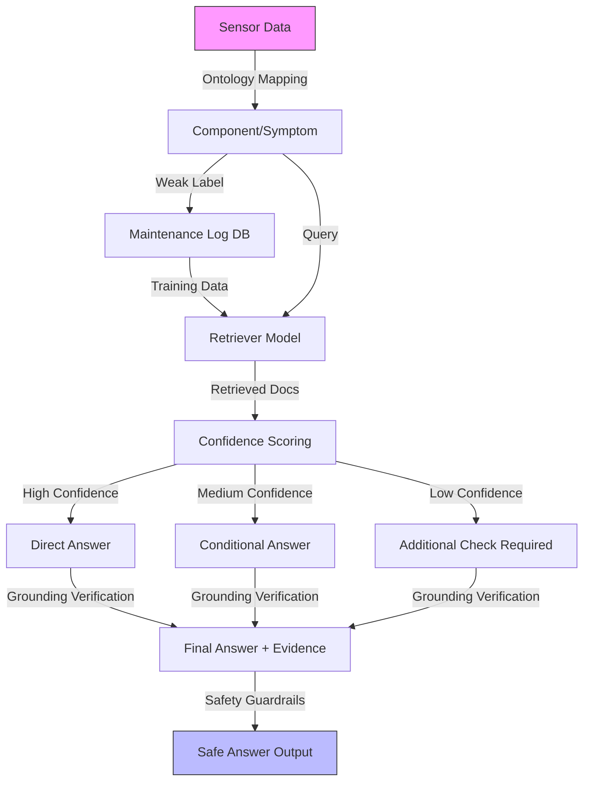

# Paper D — 구현 예시 (Implementation Examples)

> 작성일: 2026-04-14 (paper_D/case-studies/02-three-key-principles.md에서 이전)
> 목적: Paper D의 3가지 핵심 원칙 (Ontology, Weak Label, Confidence/Evidence)의 구현 스케치

`paper_d_paper_strategy.md`의 실무 핵심 3가지를 코드 레벨로 구체화한 문서.

---

## 원칙 1: 공통 Ontology

### Ontology 계층 정의 (YAML)

```yaml
ontology:
  # Layer 1: 센서 계층
  sensor:
    - sensor_id
    - sensor_type
    - component
    - unit
    - sampling_rate

  # Layer 2: 부품 계층
  component:
    - component_id
    - component_name
    - component_type
    - parent_system
    - child_parts

  # Layer 3: 증상 계층
  symptom:
    - symptom_id
    - symptom_name
    - description
    - severity_level
    - sensor_patterns

  # Layer 4: 고장모드 계층
  failure_mode:
    - failure_mode_id
    - failure_mode_name
    - description
    - root_causes
    - typical_symptoms

  # Layer 5: 조치 계층
  action:
    - action_id
    - action_name
    - action_type  # [inspection, calibration, replacement, cleaning]
    - procedure_steps
    - safety_warnings
    - required_tools

  # Layer 6: 문서 계층
  document:
    - document_id
    - document_type  # [SOP, manual, maintenance_log, troubleshooting_guide]
    - title
    - sections
    - applicable_components
    - applicable_symptoms
    - applicable_failure_modes
```

### Ontology Mapper 구현 스케치

```python
class OntologyMapper:
    def __init__(self, ontology_graph):
        self.graph = ontology_graph  # Neo4j or NetworkX

    def map_sensor_to_document(self, sensor_event):
        """센서 이벤트 → 문서까지의 경로 탐색"""
        # sensor → component
        component = self.get_component(sensor_event.sensor_id)

        # component → symptom (via pattern matching)
        symptoms = self.match_symptoms(sensor_event, component)

        # symptom → failure_mode
        failure_modes = []
        for symptom in symptoms:
            failure_modes.extend(self.get_failure_modes(symptom))

        # failure_mode → action → document
        documents = []
        for fm in failure_modes:
            actions = self.get_actions(fm)
            for action in actions:
                docs = self.get_documents(action)
                documents.extend(docs)

        return {
            'component': component,
            'symptoms': symptoms,
            'failure_modes': failure_modes,
            'documents': documents
        }
```

---

## 원칙 2: Weak Label (정비 이력 기반)

### Weak Label 강도 정의

```python
class MaintenanceLabel:
    """정비 이력 기반 Weak Label"""

    def __init__(self):
        self.label_strength = {
            'gold': 1.0,    # 명확한 원인-조치 문서화
            'silver': 0.7,  # 원인 불명확, 조치 문서화
            'weak': 0.4,    # 조치만 기록
            'none': 0.0     # 연결 불가
        }

    def create_label(self, sensor_window, maintenance_log):
        """센서-로그 쌍으로 라벨 생성"""

        time_gap = maintenance_log.timestamp - sensor_window.end_time
        component_match = (
            sensor_window.component == maintenance_log.component
        )
        cause_specified = maintenance_log.root_cause is not None

        if component_match and cause_specified and time_gap < timedelta(hours=2):
            strength = 'gold'
        elif component_match and time_gap < timedelta(hours=12):
            strength = 'silver'
        elif component_match and time_gap < timedelta(days=1):
            strength = 'weak'
        else:
            strength = 'none'

        return {
            'sensor_window': sensor_window,
            'maintenance_log': maintenance_log,
            'label_strength': strength,
            'confidence': self.label_strength[strength],
            'time_gap_hours': time_gap.total_seconds() / 3600
        }
```

### 라벨 강도별 활용

| 강도 | 정의 | 활용 | 비율 목표 |
|------|------|------|-----------|
| **Gold** | 명확한 원인-조치 문서화 | 학습/평가 핵심 데이터 | 10-20% |
| **Silver** | 원인 불명확, 조치 문서화 | 학습 데이터 확장 | 20-30% |
| **Weak** | 조치만 기록 | Weak supervision | 30-40% |
| **None** | 연결 불가 | 제외 | 20-30% |

### Hard Negative Mining

```python
def generate_hard_negatives(positive_pair, all_logs):
    """Hard negative 샘플 생성"""

    sensor_window, correct_log = positive_pair
    negatives = []

    # Type 1: 같은 부품, 다른 증상
    same_component_diff_symptom = [
        log for log in all_logs
        if log.component == correct_log.component
        and log.symptom != correct_log.symptom
    ]
    negatives.extend(same_component_diff_symptom)

    # Type 2: 다른 부품, 비슷한 증상
    diff_component_similar_symptom = [
        log for log in all_logs
        if log.component != correct_log.component
        and symptom_similarity(log.symptom, correct_log.symptom) > 0.7
    ]
    negatives.extend(diff_component_similar_symptom)

    # Type 3: 같은 고장모드, 다른 조치
    same_failure_diff_action = [
        log for log in all_logs
        if log.failure_mode == correct_log.failure_mode
        and log.action != correct_log.action
    ]
    negatives.extend(same_failure_diff_action)

    return negatives
```

---

## 원칙 3: Confidence와 Evidence 함께 출력

### Confidence 기반 답변 전략

| Confidence | 답변 전략 | 출력 |
|------------|----------|------|
| **> 0.8** | 직접 답변 | 원인 + 조치 + 근거 |
| **0.5 ~ 0.8** | 조건부 답변 | 원인 후보 + 추가 확인 권고 |
| **< 0.5** | 추가 점검 권고 | "추가 점검 필요" + 확인사항 |

### Grounded Answer Generator

```python
class GroundedAnswerGenerator:
    def __init__(self, llm, retriever):
        self.llm = llm
        self.retriever = retriever

    def generate(self, sensor_event, top_k=3):
        # 문서 검색
        retrieved_docs = self.retriever.search(sensor_event, top_k)

        # Confidence 계산
        confidence = self.calculate_confidence(sensor_event, retrieved_docs)

        # Confidence에 따른 프롬프트 선택
        if confidence > 0.8:
            prompt = self.high_confidence_prompt(sensor_event, retrieved_docs)
        elif confidence > 0.5:
            prompt = self.medium_confidence_prompt(sensor_event, retrieved_docs)
        else:
            prompt = self.low_confidence_prompt(sensor_event, retrieved_docs)

        # 답변 생성
        answer = self.llm.generate(prompt)

        # 근거 연결 검증
        verified_answer = self.verify_grounding(answer, retrieved_docs)

        return {
            'answer': verified_answer,
            'confidence': confidence,
            'evidence': retrieved_docs,
            'verification_status': 'passed' if verified_answer else 'failed'
        }

    def verify_grounding(self, answer, retrieved_docs):
        """답변의 모든 주장이 근거 문서에 연결되어 있는지 검증"""
        # 1. 조치 권고는 반드시 SOP/Manual에 연결
        # 2. 원인 분석은 FMEA/Case에 연결
        # 3. Safety warning은 반드시 문서 기반

        claims = self.extract_claims(answer)
        for claim in claims:
            if not self.has_evidence(claim, retrieved_docs):
                return False
        return True
```

### 안전 가드레일

```python
SAFETY_RULES = {
    'shutdown_required': {
        'condition': ['pressure_unstable', 'gas_leak_detected', 'high_temperature'],
        'required_evidence': ['SOP_emergency_shutdown', 'safety_manual'],
        'default_action': 'immediate_shutdown'
    },
    'override_prohibited': {
        'condition': ['interlock_active', 'safety_door_open'],
        'required_evidence': ['safety_sop_section'],
        'default_action': 'override_denied'
    },
    'maintenance_required': {
        'condition': ['calibration_overdue', 'pm_schedule_due'],
        'required_evidence': ['maintenance_schedule', 'SOP_maintenance'],
        'default_action': 'schedule_maintenance'
    }
}

def apply_safety_guardrails(answer, sensor_event):
    """안전 규칙 적용"""
    for rule_name, rule in SAFETY_RULES.items():
        if any(condition in sensor_event.symptoms
               for condition in rule['condition']):
            if not has_required_evidence(answer, rule['required_evidence']):
                answer = (
                    f"[SAFETY ALERT] {rule['default_action']}. "
                    f"Required evidence: {rule['required_evidence']}"
                )
    return answer
```

---

## 통합 아키텍처 (Mermaid Diagram)



---

## 구현 체크리스트

**Ontology**:
- [ ] sensor → component → symptom → failure_mode → action → document 경로 정의
- [ ] 각 계층별 속성 정의
- [ ] Graph DB(Neo4j 또는 NetworkX)에 저장

**Weak Label**:
- [ ] 정비 이력에서 gold/silver/weak/none 라벨 생성
- [ ] 시간적 연결 정의 (±1일/±3일/±7일)
- [ ] Hard negative mining 구현

**Confidence & Evidence**:
- [ ] Confidence scoring 함수 구현
- [ ] 근거 연결 검증 로직 구현
- [ ] Safety guardrails 정의

---

## 한 줄 요약

> **Ontology로 구조를 잡고, Weak Label로 학습하며, Confidence와 Evidence로 안전하게 답변하라.**
